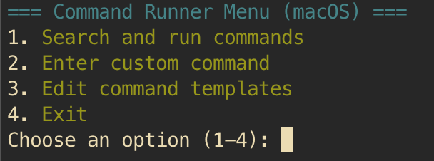
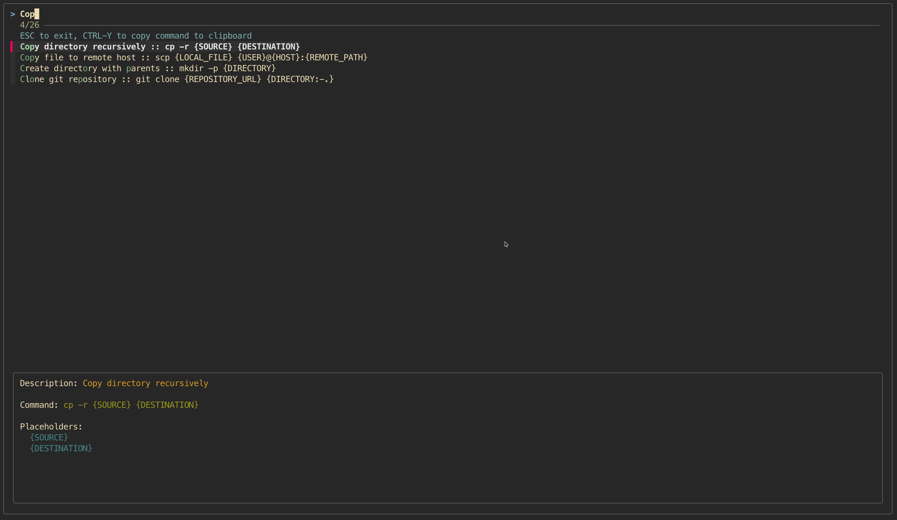

# Bash-TUI-Example
A starter package for a Bash text user interface (TUI) menu. Helpful for occasions where you have a long list of complex commands or want to create a menu of commands so the user simply picks commands to run. Provides the option for the user to enter command variables before running the command, as well as custom commands.

## Prerequisites
Requires [fzf](https://github.com/junegunn/fzf)

## Examples

Main menu:

Search and run commands:

Running commands with variables:

